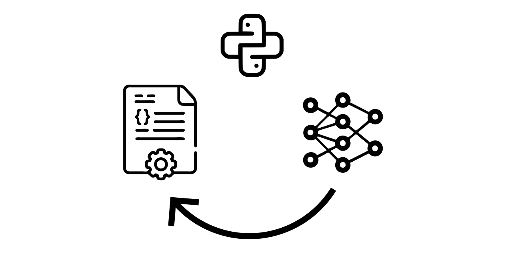

# PSyKE



Quick links:
* [Home Page](https://apice.unibo.it/xwiki/bin/view/PSyKE/)
* [GitHub Repository](https://github.com/psykei/psyke-python)
* [PyPi Repository](https://pypi.org/project/psyke/)
* [Issues](https://github.com/psykei/psyke-python/issues)

## Latest Releases

* PSyKE 1.0: Compatibility with Python 3.11.x
* PSyKE 0.10: New genetic algorithms for knowledge extraction
* PSyKE 0.9: Fairness mitigation support for knowedge extractors
* PSyKE 0.8: New features: local explainability and counterfactual support
* PSyKE 0.7: New SKE algorithms implemented

## Intro

[PSyKE](https://apice.unibo.it/xwiki/bin/view/PSyKE/) (Platform for Symbolic Knowledge Extraction)
is intended as a library for extracting symbolic knowledge (in the form of logic rule lists) out of sub-symbolic predictors.

More precisely, PSyKE offers a general purpose API for knowledge extraction, and a number of different algorithms implementing it,
supporting both classification and regression problems.
The extracted knowledge consists of a Prolog theory (i.e., a list of Horn clauses) or an OWL ontology containing SWRL rules.

PSyKE relies on [2ppy](https://github.com/tuProlog/2ppy) (tuProlog in Python) for logic support, which in turn is based on the [2p-Kt](https://github.com/tuProlog/2p-kt) logic ecosystem.

### Class diagram overview:


<!--
To generate/edit the class diagram browse the URL above, after replacing `svg` with `uml`
-->

PSyKE is designed around the notion of _extractor_.
More precisely, an `Extractor` is any object capable of extracting a logic `Theory` out of a trained sub-symbolic regressor or classifier.
Accordingly, an `Extractor` is composed of 
_(i)_ a trained predictor (i.e., black-box used as an oracle) and 
_(ii)_ a set of feature descriptors, and it provides two methods:
* `extract`: returns a logic theory given a dataset;
* `predict`: predicts a value using the extracted rules (instead of the original predictor).

Currently, the supported extraction algorithms are:
* [CART](https://doi.org/10.1201/9781315139470),
straightforward extracts rules from both classification and regression decision trees;
* Classification:
  * [REAL](http://dx.doi.org/10.1016/B978-1-55860-335-6.50013-1) (Rule Extraction As Learning),
  generates and generalizes rules strarting from dataset samples;
  * [Trepan](http://dx.doi.org/10.1016/B978-1-55860-335-6.50013-1),
  generates rules by inducing a decision tree and possibly exploiting m-of-n expressions;
* Regression:
  * [ITER](http://dx.doi.org/10.1007/11823728_26),
  builds and iteratively expands hypercubes in the input space.
  Each cube holds a constant value, that is the estimated output for the samples inside the cube;
  * [GridEx](http://dx.doi.org/10.1007/978-3-030-82017-6_2),
  extension of the ITER algorithm that produces shorter rule lists retaining higher fidelity w.r.t. the predictor.
  * GridREx,
  extension of GridEx where the output of each hypercube is a linear combination of the input variables and not a constant value.
  
Users may exploit the PEDRO algorithm, included in PSyKE, to tune the optimal values for GridEx and GridREx hyper-parameters.

We are working on PSyKE to extend its features to encompass explainable clustering tasks, as well as to make more general-purpose the supported extraction algorithms (e.g., by adding classification support to GridEx and GridREx).

## Users

### End users

PSyKE is deployed as a library on Pypi. It can be installed as Python package by running:
```bash
pip install psyke
```

#### Requirements

Please refer to the [requirements file](https://github.com/psykei/psyke-python/blob/master/requirements.txt)

##### Test requirements
* `skl2onnx`
* `onnxruntime`
* `parameterized`

Once installed, it is possible to create an extractor from a predictor 
(e.g. Neural Network, Support Vector Machine, K-Nearest Neighbours, Random Forest, etc.)
and from the data set used to train the predictor.

> **Note:** the predictor must expose a method named `predict` to be properly used as an oracle.

#### End users

A brief example is presented in `demo.py` script in the `demo/` folder.
Using `sklearn`'s Iris data set we train a K-Nearest Neighbours to predict the correct output class.
Before training, we make the dataset discrete.
After that we create two different extractors: REAL and Trepan.
We output the extracted theory for both extractors.

REAL extracted rules:
```
iris(PetalLength, PetalWidth, SepalLength, SepalWidth, setosa) :- PetalWidth =< 1.0.
iris(PetalLength1, PetalWidth1, SepalLength1, SepalWidth1, versicolor) :- PetalLength1 > 4.9, SepalWidth1 in [2.9, 3.2].
iris(PetalLength2, PetalWidth2, SepalLength2, SepalWidth2, versicolor) :- PetalWidth2 > 1.6.
iris(PetalLength3, PetalWidth3, SepalLength3, SepalWidth3, virginica) :- SepalWidth3 =< 2.9.
iris(PetalLength4, PetalWidth4, SepalLength4, SepalWidth4, virginica) :- SepalLength4 in [5.4, 6.3].
iris(PetalLength5, PetalWidth5, SepalLength5, SepalWidth5, virginica) :- PetalWidth5 in [1.0, 1.6].
```

Trepan extracted rules:
```
iris(PetalLength6, PetalWidth6, SepalLength6, SepalWidth6, virginica) :- PetalLength6 > 3.0, PetalLength6 in [3.0, 4.9].
iris(PetalLength7, PetalWidth7, SepalLength7, SepalWidth7, versicolor) :- PetalLength7 > 3.0.
iris(PetalLength8, PetalWidth8, SepalLength8, SepalWidth8, setosa) :- true.
```


## Developers

Working with PSyKE codebase requires a number of tools to be installed:
* Python 3.11
  + Python version >= `3.12.x` are currently __not__ supported

* JDK 11+ (please ensure the `JAVA_HOME` environment variable is properly configured)
* Git 2.20+

### Develop PSyKE with PyCharm

To participate in the development of PSyKE, we suggest the [PyCharm](https://www.jetbrains.com/pycharm/) IDE.

#### Importing the project

1. Clone this repository in a folder of your preference using `git_clone` appropriately
2. Open PyCharm
3. Select `Open`
4. Navigate your file system and find the folder where you cloned the repository
5. Click `Open`

### Developing the project

Contributions to this project are welcome. Just some rules:
* We use [git flow](https://github.com/nvie/gitflow), so if you write new features, please do so in a separate `feature/` branch
* We recommend forking the project, developing your code, then contributing back via pull request
* Commit often
* Stay in sync with the `develop` (or `master`) branch (pull frequently if the build passes)
* Do not introduce low quality or untested code

#### Issue tracking
If you meet some problems in using or developing PSyKE, you are encouraged to signal it through the project
["Issues" section](https://github.com/psykei/psyke-python/issues) on GitHub.
